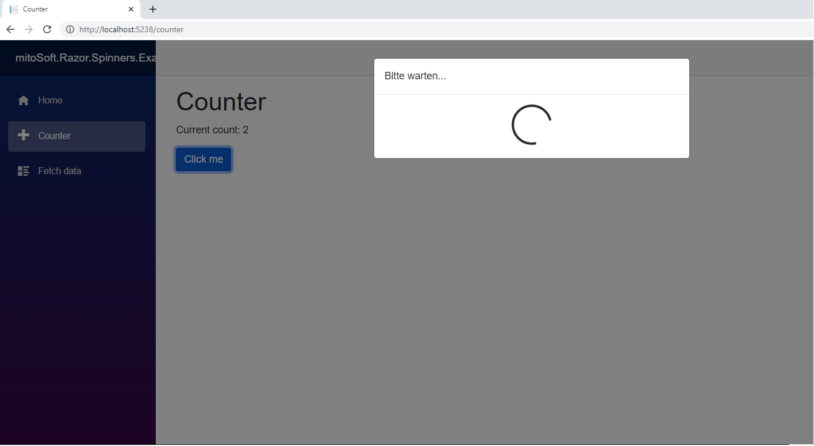

# mitoSoft.Razor.Spinners
A library providing different spinners for Blazor websites.
It is possible to use with .Net5 as well as .Net6.
It comes with a so-called ModalSpinner and an OverlaySpinner.

## Dependencies

 - Microsoft.AspNetCore.Components.Web (5.0.12)
 - mitoSoft.Razor.Components (6.1.1)

## ModalSpinner

The ModalSpinner is a standard Bootstrap spinner embedded in a Bootstrap modal.
The usage is shown in the following code snippet:

```c#
  
  ...
  
  <mitoSoft.Razor.Spinners.ModalSpinner @ref="@_modal" />

  @code {
    private int currentCount = 0;
    private mitoSoft.Razor.Spinners.ModalSpinner _modal = default!;

    private void IncrementCount()
    {
        _modal.Show();

        await Task.Delay(5000);

        currentCount++;
        
		_modal.Hide();
    }
 
    ...

```

### Look and Feel



## OverlaySpinner

The OverlaySpinner pops up a standard Bootstrap spinner in front of a shaded overlay, which disable all frontend controls and avoid users of breaking their actual session.
The usage is shown in the following code snippet:

```c#
  
  ...
  
  <mitoSoft.Razor.Spinners.OverlaySpinner @ref="@_overlay" />

  @code {
    private int currentCount = 0;
    private mitoSoft.Razor.Spinners.OverlaySpinner _overlay = default!;
    
    private void IncrementCount()
    {
        _overlay.Show();

        await Task.Delay(5000);

        currentCount++;
        
		_overlay.Hide();
    }
 
    ...

```

### Look and Feel


###Properties

By the use of 'MarginTop' it is possible to set the distance between the spinners parent top border and the spinner itself - the default value is 8rem.

```c#
  
  <mitoSoft.Razor.Spinners.OverlaySpinner MarginTop="1" @ref="@_overlay" />

```
